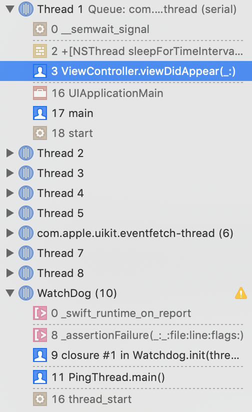

# Watchdog

[](http://swift.org)
[](https://travis-ci.org/wojteklu/Watchdog) [](https://github.com/wojteklu/Watchdog/blob/master/LICENSE)  [](https://cocoapods.org/pods/Watchdog)  [](https://github.com/Carthage/Carthage)  [](https://github.com/wojteklu/Watchdog/blob/master/LICENSE)

Class for logging excessive blocking on the main thread. It watches the main thread and checks if it doesn’t get blocked for more than defined threshold.

```
👮 Main thread was blocked for 1.25s 👮
```

You can also inspect which part of your code is blocking the main thread.

<p align="left">
  
</p>

## Usage

Simply, just instantiate Watchdog with number of seconds that must pass to consider the main thread blocked. Additionally you can enable `strictMode` that stops the execution whenever the threshold is reached. This way, you can inspect which part of your code is blocking the main thread.

```Swift
let watchdog = Watchdog(threshold: 0.4, strictMode: true)
```

Don't forget to retain Watchdog somewhere or it will get released when it goes out of scope.

## Requirements

* iOS 8.0+, tvOS 9.0+ or macOS 10.9+
* Swift 5.0

## Installation

### [Carthage]

[Carthage]: https://github.com/Carthage/Carthage

Add the following to your Cartfile:

```
github "wojteklu/Watchdog"
```

Then run `carthage update`.

Follow the current instructions in [Carthage's README][carthage-installation]
for up to date installation instructions.

[carthage-installation]: https://github.com/Carthage/Carthage#adding-frameworks-to-an-application

### [CocoaPods]

[CocoaPods]: http://cocoapods.org

Add the following to your [Podfile](http://guides.cocoapods.org/using/the-podfile.html):

```ruby
pod 'Watchdog'
```

You will also need to make sure you're opting into using frameworks:

```ruby
use_frameworks!
```

### Manually

Manually add the file into your Xcode project. Slightly simpler, but updates are also manual.

## Author

Wojtek Lukaszuk [@wojteklu](http://twitter.com/wojteklu)

## License

Watchdog is available under the MIT license. See the LICENSE file for more info.
